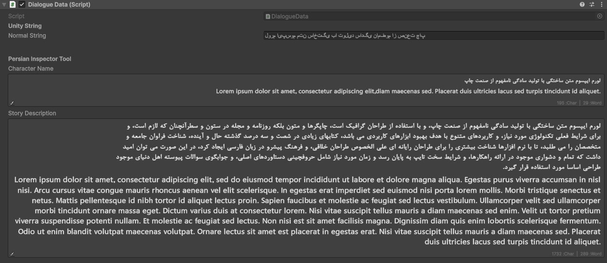
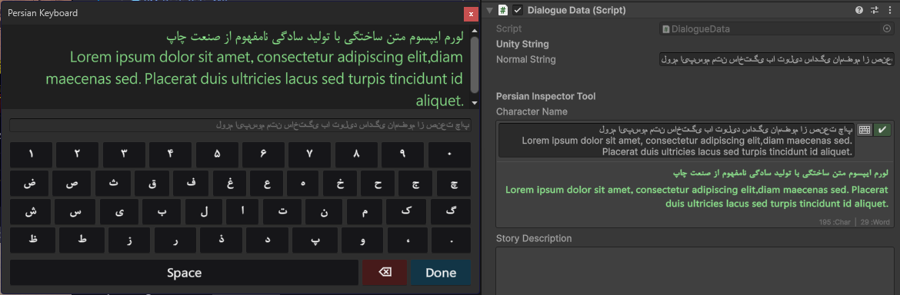

# Unity Persian Inspector Tool 🇮🇷

A professional, lightweight editor extension for rendering **Persian and Arabic** text correctly inside the Unity Inspector.

Unity's default Inspector does not support RTL (Right-to-Left) text shaping, causing disjointed letters. This tool provides a seamless **"Hybrid Editing"** experience with a custom **Virtual Keyboard**, **Bi-Directional Text Support**, and **Custom Font** rendering.



-------------------------------------------------------------------------------



## ✨ Key Features

* **RTL Text Shaping:** Automatically connects letters and reverses text for correct display inside the Inspector.
* **Mixed Text Support:** Correctly handles sentences containing both **Persian/Arabic** and **English** words (Bi-Directional).
* **Hybrid Workflow:**
  * **View Mode:** Displays beautiful, readable Persian text (Compact style).
  * **Edit Mode:** Click to edit raw text with a live preview and a **Quick Confirm** (✔) button.
* **Virtual Keyboard:** Built-in floating keyboard for typing Persian characters without changing your OS language.
* **Custom Fonts:** Render Inspector text using your own `.ttf` fonts (e.g., Vazir, Yekan) via the Config menu.
* **Per-Field Styling:** Customize font size individually for specific text fields.
* **Smart Stats:** Displays real-time Character and Word counts.
* **Zero Dependencies:** No heavy plugins or DLLs required.

## 📦 Installation

1. Go to the [Releases](../../releases) page of this repository.
2. Download the latest `.unitypackage` file.
3. In Unity, go to `Assets > Import Package > Custom Package` and select the downloaded file.

## 🚀 Usage

Simply add the `[PersianText]` attribute to any `string` field in your `MonoBehaviour` or `ScriptableObject`.

```csharp
using UnityEngine;
using MJ.EditorTools;

public class DialogueData : MonoBehaviour
{
    [Header("Story Settings")]
    
    // Basic usage
    [PersianText]
    public string CharacterName;

    // Advanced usage: Custom Line Limits & Font Size
    [PersianText(minLines: 3, maxLines: 10, fontSize: 14)]
    public string StoryDescription;
    
    // Large text field
    [PersianText(minLines: 5, maxLines: 20)]
    public string FullScript;
}
```

## ⚙️ Configuration (Custom Fonts)

To use a custom Persian font in the Inspector (instead of the default Arial):

1. Navigate to `Tools > MJ Tools > Persian Settings` in the Unity menu bar.
2. A settings file will be created/selected in your `Resources` folder.
3. Drag and drop your `.ttf` font file into the **Custom Font** field.
4. You can also adjust the **Font Size** and **Text Colors** here.

## 🤝 Contributing

Contributions are welcome! Please feel free to submit a Pull Request.

## 📄 License

This project is licensed under the MIT License.